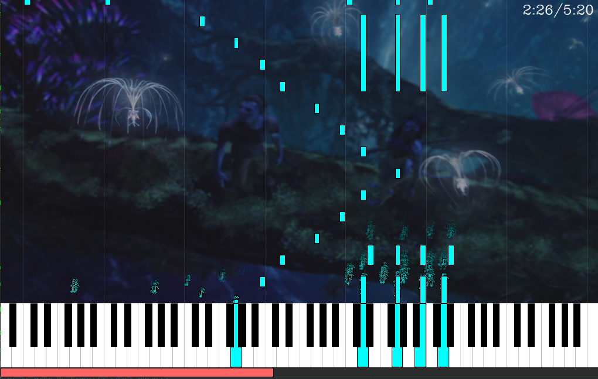

# Python MIDI Player working on Linux/Windows

  

## Requirements
- **Python 3.6+**, **pip**
- For linux : **libasound2-dev**, **libjack-dev** or something similar (alsa/jack).

## Installation
`pip install --user -r requirements.txt`

## Usage
`python main.py [options ...] [midifiles ...]`

Press ` ` (space) to play/pause. You can also click on the player bar to move forward/backward.

### Create a new particle texture
- Draw the particle that you want, pure white (255, 255, 255) will be transparent,
pure black (0,0,0) will be replaced by the channel color, and the rest will be unchanged.
Save it as PNG in resources, then use --particles_texture filename. (without the extension .png)

### Use another background
- Save the background as PNG in resources, then use --background_image filename. (without the extension .png)

  

  

### Serial communication
- Send approximactivly 100 times/sec 88bits that correspond to the 88 notes of the piano. 0 is note off, 1 is note on.

    `python main.py --serial YOUR_SERIAL_PORT --baudrate YOUR_BAUDRATE file.mid`

### Troubleshooting
- The Gui is a bit laggy

    Disable Particles via option --no_particles

- There is no sound

    The Player doesn't produce any sound by itself. You need a MIDI synthesizer.

    On Windows, you probably already have one, but probably not on linux.

    Open a port with Timidity:

      install a soundfond like soundfond-fluid and a Jack Audio Connection Kit

      install Timidity++

      sudo modprobe snd-seq-device

      sudo modprobe snd-seq-midi

      timidity -iA -B2,8 -Os1l -s 44100

    List open port : `python main.py --list_port`

    Specify the port : `python main.py --port "TiMidity:TiMidity port 0 128:0" file.mid`

- The sound is ugly

    Your synthesizer/soundfont is bad. Change it. Or change midi port.
